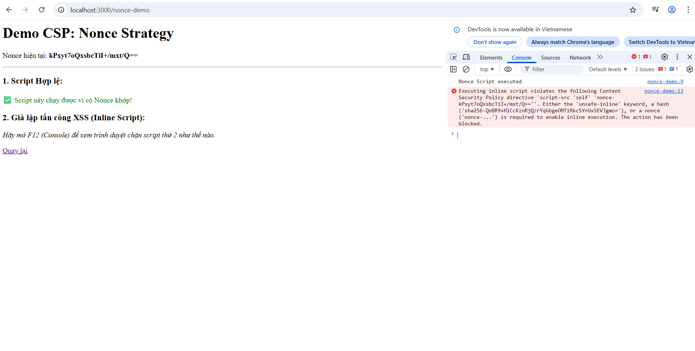
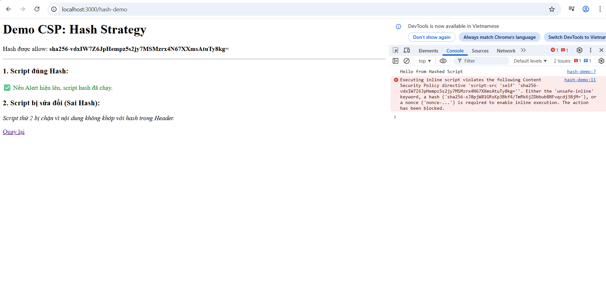

# BÁO CÁO CHUYÊN ĐỀ: PHÁT TRIỂN PHẦN MỀM WEB AN TOÀN
## Đề tài: Content Security Policy Nâng cao (Nonce & Hash)

Dự án demo việc ngăn chặn tấn công XSS (Inline Script) bằng cách sử dụng Content Security Policy (CSP) với kỹ thuật Nonce và Hash SHA-256.

### 1. Danh sách thành viên nhóm
| STT | Họ và tên | Mã sinh viên | Lớp | Vai trò |
|:---:|:---|:---|:---|:---|
| 1 | **Bùi Anh Quân** | 22810310251 | D17CNPM6 | Trưởng nhóm (Dev & Report) |


### 2. Phân chia công việc
- **Bùi Anh Quân:**
  - Nghiên cứu lý thuyết về CSP, Nonce, Hash.
  - Xây dựng Web Server với Node.js & Express.
  - Viết mã nguồn demo chặn Inline Script.
  - Viết báo cáo và quay video demo.

### 3. Yêu cầu hệ thống & Cài đặt
**Yêu cầu:**
- Node.js (v14 trở lên)
- Trình duyệt Google Chrome (để kiểm tra Console Log)

**Cài đặt:**
```bash
# 1. Clone dự án (nhánh production)
git clone -b production <LINK_GIT_CUA_BAN>

# 2. Di chuyển vào thư mục
cd <TEN_THU_MUC>

# 3. Cài đặt thư viện
npm install express crypto

**Nonce Demo:**


**Hash Demo:**

